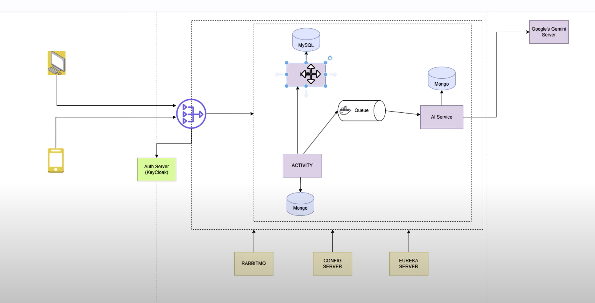

# Springboot_Microservices_With_AI

# Tech Stack

- Spring Boot: For building the microservices.
- Spring Cloud: For managing microservices and service discovery.
- Eureka: For service discovery.
- Spring Cloud Gateway: For routing requests to the appropriate microservice.
- KeyCloak: For authentication and authorization.
- RabbitMQ: For message brokering.
- PostgreSQL: For the database.
- Google Gemini API: For AI functionalities.
- Spring Cloud Config: For externalized configuration management.